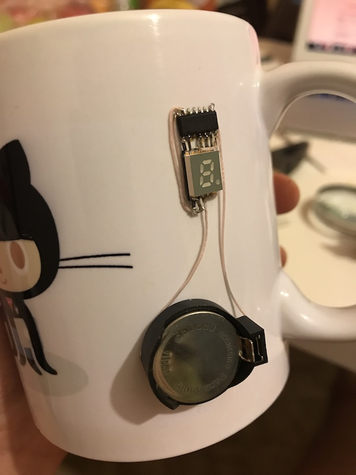

# Temperature sensor on the tea cup

Features:

* Deep sleep by default 😴 (already a month on a single coin battery)
* When hot, display temperature every 4 seconds
* When restarted, display temperature once (try to press on a coin!)
* No dependencies
* Super easy to repeat

I used attiny24, which means attiny44/84 will work without code code changes. I also recommend to find smd seven segment display (I found some cheap 0.2 inch sized - they work great). All resistors are 330 Ohm. Battery compartment is hot-glued, microcontroller is super-glued. Attiny hardware support for arduino files: [ATTinyCore](https://github.com/SpenceKonde/ATTinyCore).

## Suggestions

I used direct output to the port because it saves a lot of program space. For example, sevseg library will take additional 1.5kb of program space as cost for ease and flexibility, so you need attiny44/84 to keep it. I decided to use my super-simple mapping so I go with attiny24.

Calibrate your temperature readings! Instead of calibrating just the Tos (tempereature offset, see datasheet) to get accurate readings on the microcontroller case, I measured and calibrated readings against water temperature, so the reading is not "how hot is the cup" but closer to "how hot is the content of the cup". Make some measurements with hot and warm water and change the formula in the `getTemp()` function.

Mine formulas are integer-only, but you can use floating point without any problems: floating point operation will take additional 0.8kb of program space, but since whole sketch compiles to 0.8kb already, even with attiny24 you have room to do that.

Thin cups get readings faster and more accurate.

## License

MIT
